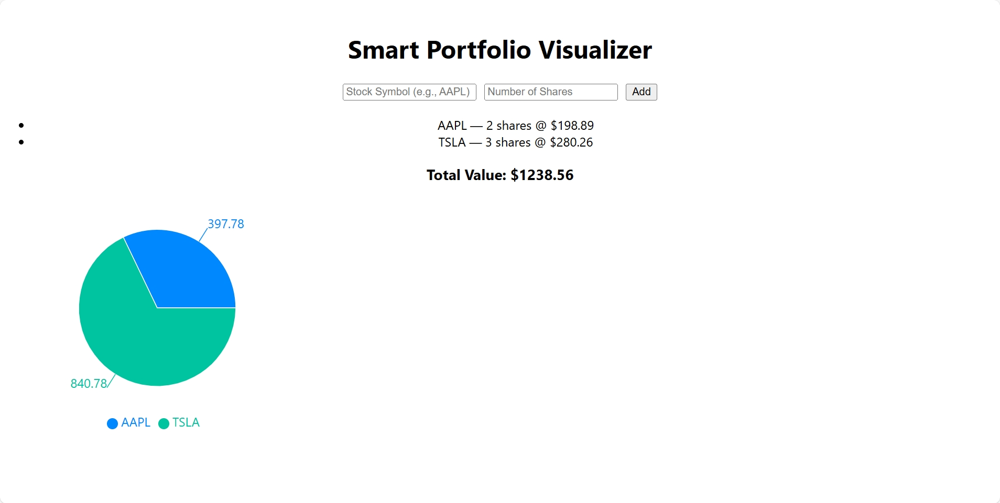

# 📈 Smart Portfolio Visualizer

Smart Portfolio Visualizer is a simple React web application that allows users to track the value of their stock portfolio in real time. Users can enter stock symbols and number of shares, and the app will fetch live prices and display the total value along with a visual pie chart.

---

## 🔧 Technologies Used

- **React** — Front-end framework
- **JavaScript (ES6)** — Main programming language
- **Recharts** — For pie chart visualization
- **Alpha Vantage API** — To fetch real-time stock prices
- **HTML/CSS** — For layout and styling

---

## 🧠 What the App Does

- Allows users to enter any valid stock symbol (like AAPL or TSLA)
- Fetches the current stock price using Alpha Vantage API
- Calculates total portfolio value based on shares and price
- Displays portfolio breakdown in a pie chart
- Shows error messages for invalid or unavailable stocks

---

### Screenshots

